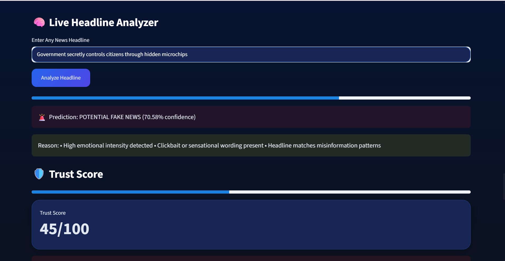
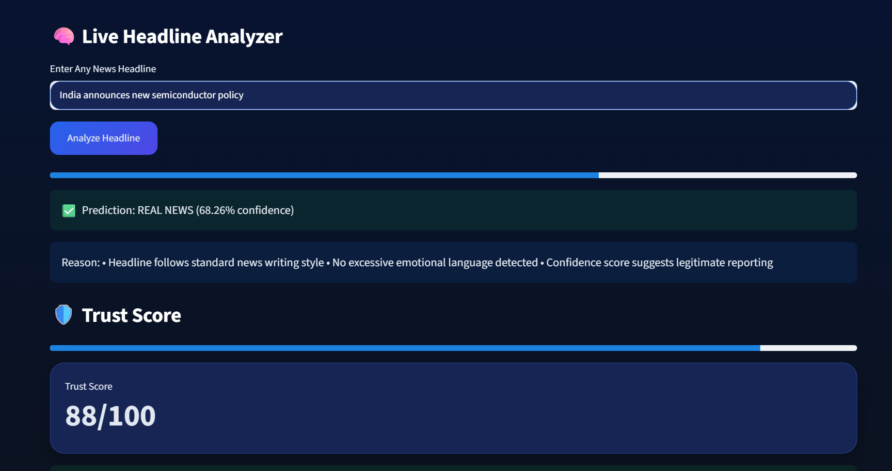

# EchoTrace

## The Internet's Early Warning System for Viral Misinformation

EchoTrace is an AI-powered misinformation detection platform that combines machine learning, trust scoring, virality prediction, and live news verification to evaluate the credibility of news headlines.

---

## Features

### Fake News Detection

Uses a trained machine learning model on Fake.csv and True.csv datasets to classify headlines as:

- Real News
- Potential Fake News

### Trust Score

Generates a dynamic trust score based on:

- ML confidence
- Live verification status
- Suspicious language indicators

### Live News Verification

Integrates NewsAPI to verify whether similar trusted articles exist online.

### Virality Prediction

Predicts potential spread of a headline:

- Normal Reach
- Moderate Reach
- High Viral Potential

### Trigger Word Analysis

Detects suspicious words commonly associated with misinformation and clickbait.

### Final Verdict System

Combines machine learning predictions and real-world verification to generate:

- Likely Real News
- Needs Verification
- Likely Fake News

---

## Tech Stack

- Python
- Streamlit
- Scikit-Learn
- Pandas
- NumPy
- SQLite
- NewsAPI
- Joblib

---

## Machine Learning Pipeline

Headline
↓
Text Preprocessing
↓
TF-IDF Vectorization
↓
Trained Fake News Classifier
↓
Confidence Score
↓
Live Verification (NewsAPI)
↓
Trust Score
↓
Final Verdict

---

## Future Improvements

- BERT-based transformer models
- Social media monitoring
- Source credibility scoring
- Multilingual support

## Project Screenshots

### Dashboard

### Fake News Detection

### Live Verification

### Real News Example

### Trust Score & Final Verdict

